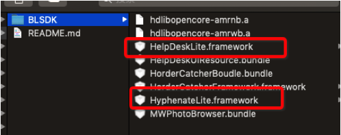
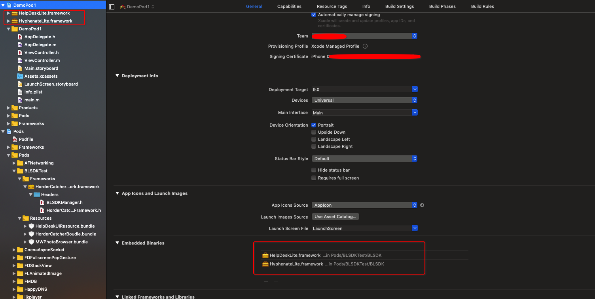

# BLSDKTest
测试SDK
iOS娃娃部落SDK集成文档

一、	CocoaPods 集成

1.1、	Podfile 里面添加 pod ‘BLSDK’

1.2、	终端执行pod update --no-repo-update 命令

1.3、	在BLSDK 文件夹下把这两个动态库拖进工程,并加到 Enable Binaries

HelpDeskLite.framework
HyphenateLite.framework

这是集成Demo
https://github.com/j976573957/BLSDKTestDemo

1．4、在info.plist 里面添加支持 http 请求参数

1.4、	不支持Bitcode ，去BuildSetting 里面设置为 NO

1.5、	不支持 armv7， 去BuildSetting 里面去掉

1.6、	客服模块需要使用到摄像头和相册权限，需要在info.plist 添加

NSCameraUsageDescription  摄像头权限

NSPhotoLibraryUsageDescription 相册权限

1.7、	使用通过push进入，需传人 NavigationController

例如：

导入头文件

1.7.1、#import <HorderCatcherFramework/HorderCatcherFramework.h>

1.7.2、使用 BLSDKManager 即可

